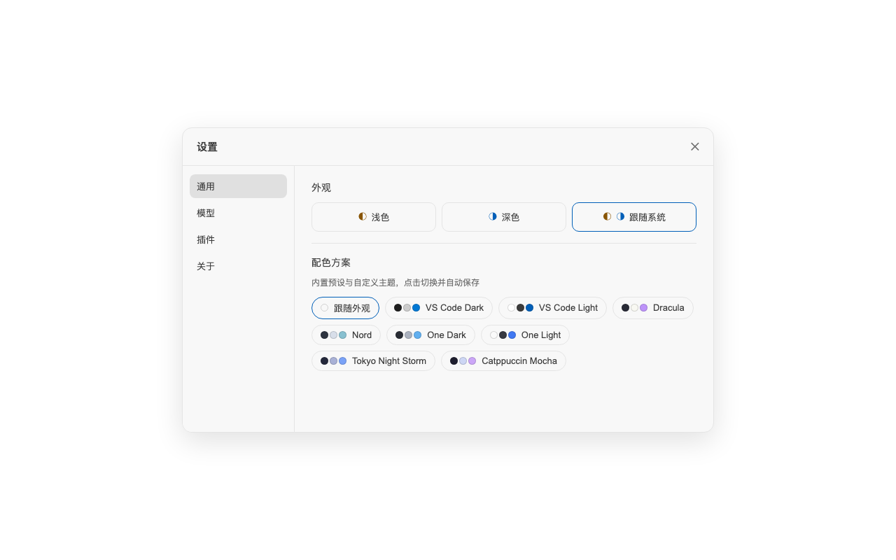
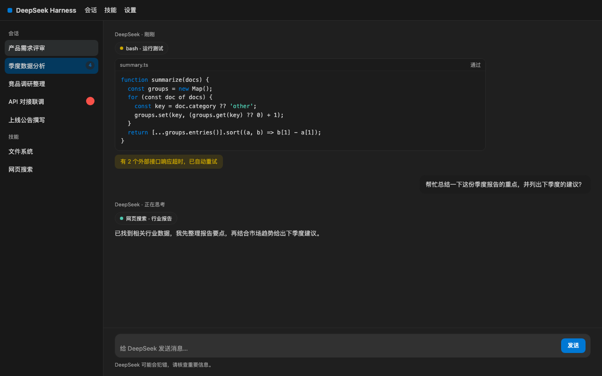
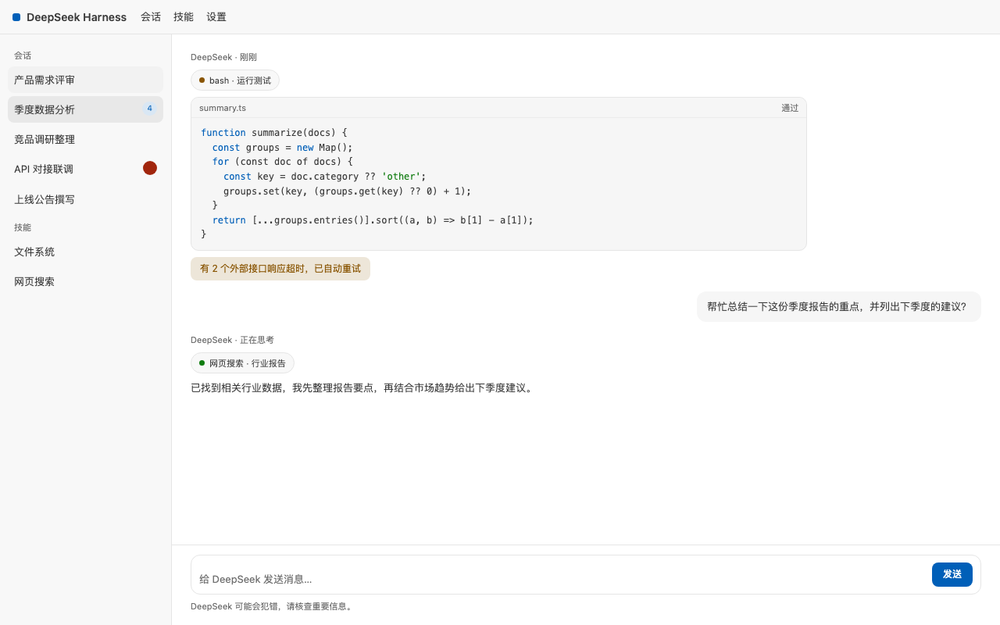
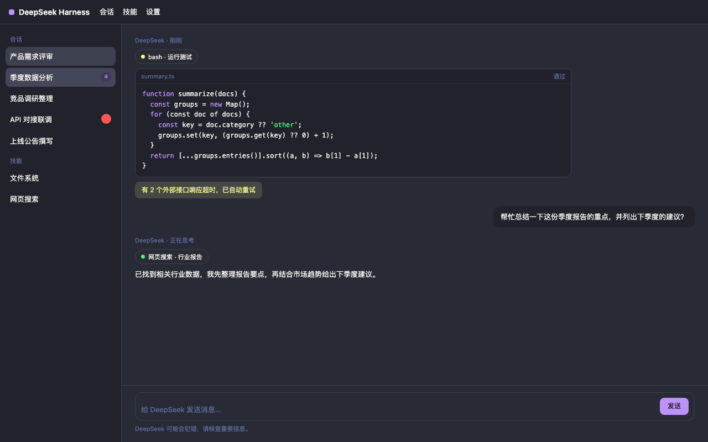
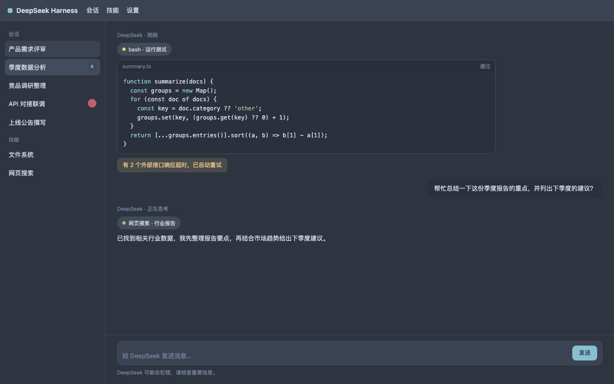
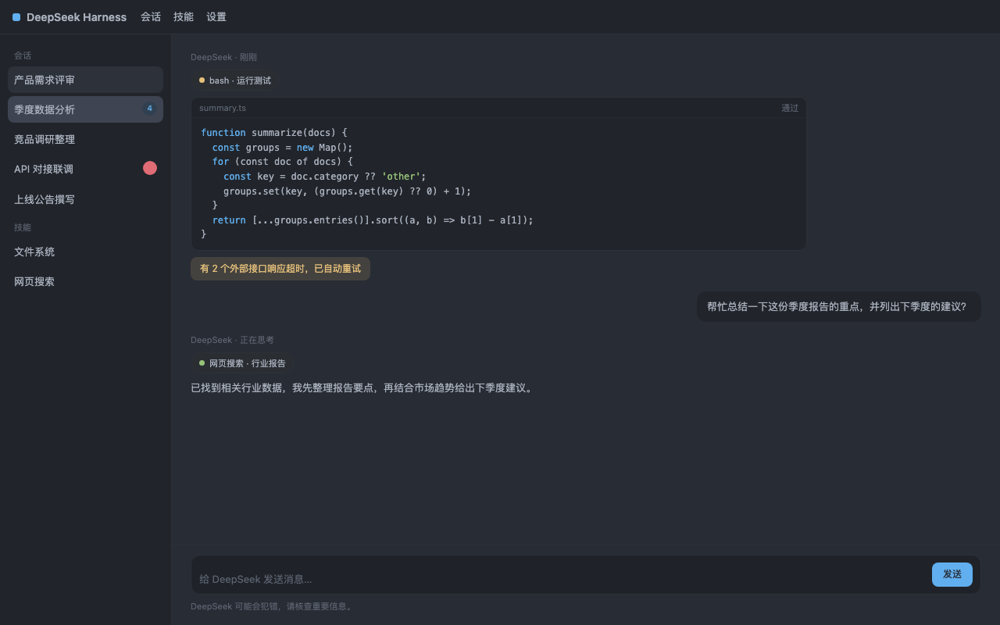
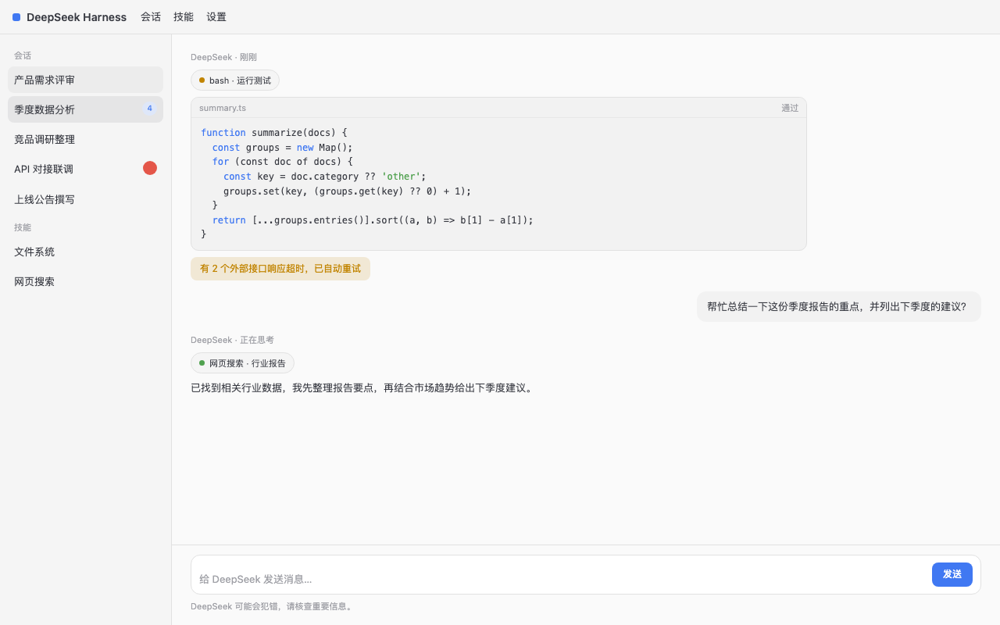
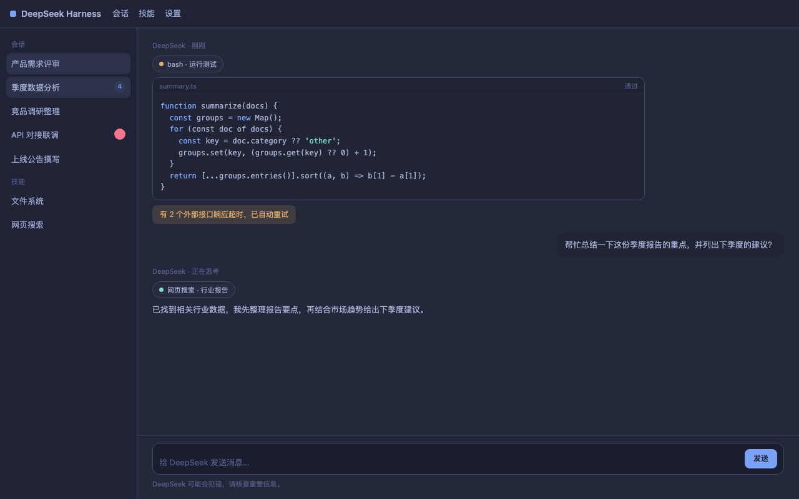
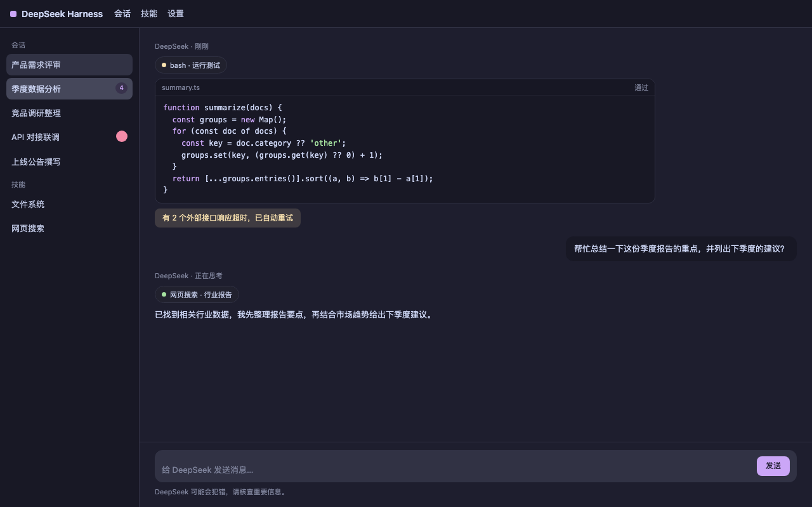

# dsh-plugin-colorscheme

[English](README.en.md)

为 DeepSeek Harness 提供配色方案（colorscheme）：内置多款知名开源主题的
配色，加载后可在 **设置 → 通用 → 配色方案** 中一键切换，选择会持久化并
在刷新后自动恢复。

- 内置 8 个预设主题（Dracula、Nord、One Dark/Light、Tokyo Night、
  Catppuccin Mocha、VS Code Dark/Light），许可与署名见
  [`THIRD_PARTY_NOTICES.md`](THIRD_PARTY_NOTICES.md)
- 支持三种用户扩展方式（见下）

## 预览

设置 → 通用 → **配色方案** 选择器（外观行下方，点击即切换并持久化）：



各主题效果：

| 主题 | 预览 |
| --- | --- |
| VS Code Dark |  |
| VS Code Light |  |
| Dracula |  |
| Nord |  |
| One Dark |  |
| One Light |  |
| Tokyo Night Storm |  |
| Catppuccin Mocha |  |

## 扩展方式

### 1. 主题目录（推荐）

把主题 JSON 文件放进 `~/.dsh/themes/`（或通过 `themesDir` 配置指向其他
目录），每个文件一个主题：

```json
{
  "id": "my-solarized-dark",
  "name": "My Solarized Dark",
  "colorScheme": "dark",
  "roles": {
    "bg": "#002b36",
    "fg": "#839496",
    "accent": "#268bd2"
  }
}
```

上面的示例用 `roles` 描述配色（背景、文字、强调色等），通常够用；想
进一步微调时，也可以直接写展开后的 `tokens`（键以 `--dsw-` 开头）。
`id` 不能与内置主题重名。

### 2. 插件配置

编辑 `~/.dsh/profiles/web/cordis.patch.yml`：

```yaml
- insert:
    - id: colorscheme
      name: dsh-plugin-colorscheme
      config:
        themesDir: /abs/path/to/my/themes   # 默认 ~/.dsh/themes
        defaultTheme: dracula               # 未手动选择时的默认主题
```

### 3. settings 用户层

直接编辑 `~/.dsh/settings.yaml`：

```yaml
colorscheme:
  selection: dracula
  customThemes:
    - id: my-inline-theme
      name: My Inline Theme
      colorScheme: light
      tokens:
        --dsw-alias-bg-base: "#ffffff"
        --dsw-alias-label-primary: "#333333"
```

保存后重启 `dsh web`（或等待 HMR）。`customThemes` 与主题目录文件等价。

### 贡献主题

- **想让主题随插件开箱即用**（所有用户装上就有）：作为内置预设提交，在
  `src/themes/presets.ts` 新增条目，并在 `THIRD_PARTY_NOTICES.md` 与
  `presets-licenses/` 中补充署名与许可。
- **只想分享一个自定义主题文件**：放进 `example-themes/` 作为示例即可
  （注意：示例不会被自动加载，使用者需复制到 `~/.dsh/themes/` 才会生效）。

## 许可

插件代码为 MIT（[LICENSE](LICENSE)）。内置预设的原色板归属与许可见
[`THIRD_PARTY_NOTICES.md`](THIRD_PARTY_NOTICES.md) 与
[`presets-licenses/`](presets-licenses/)。
